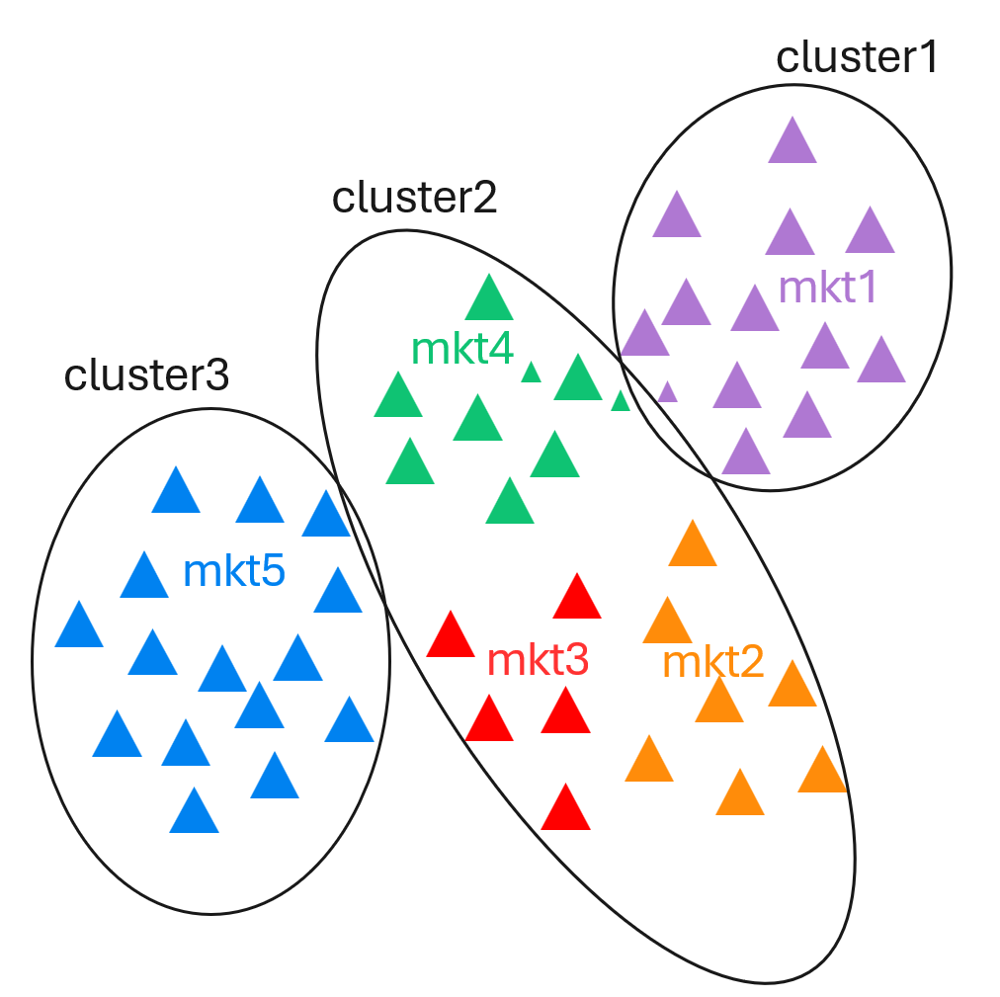
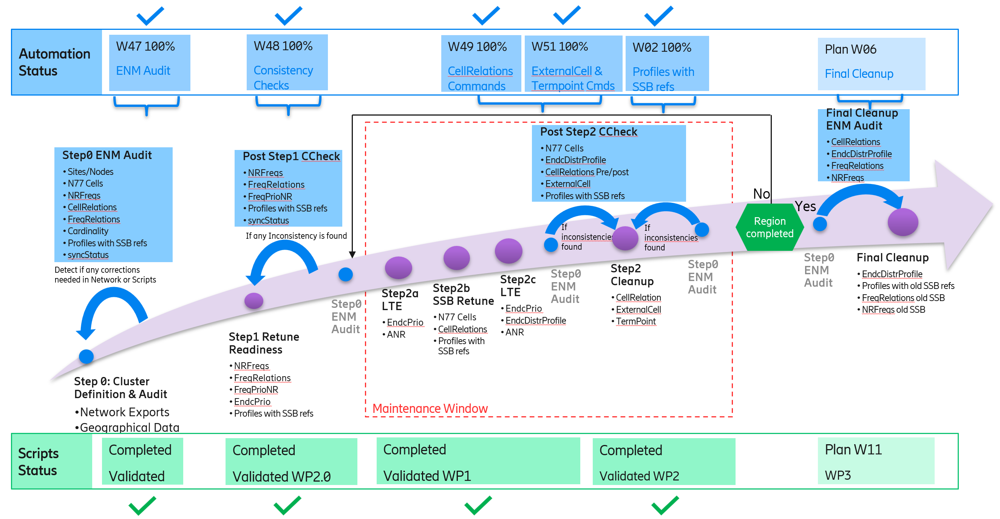
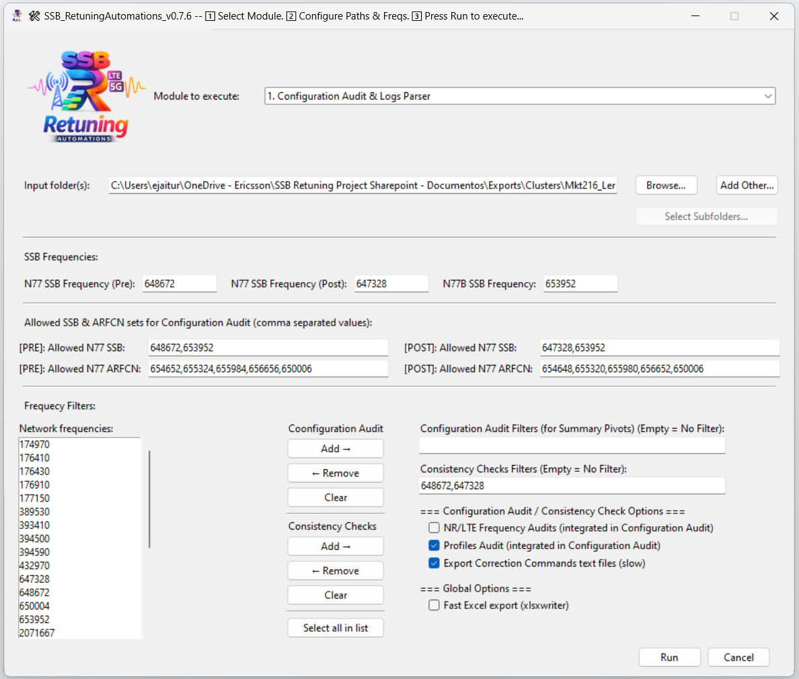
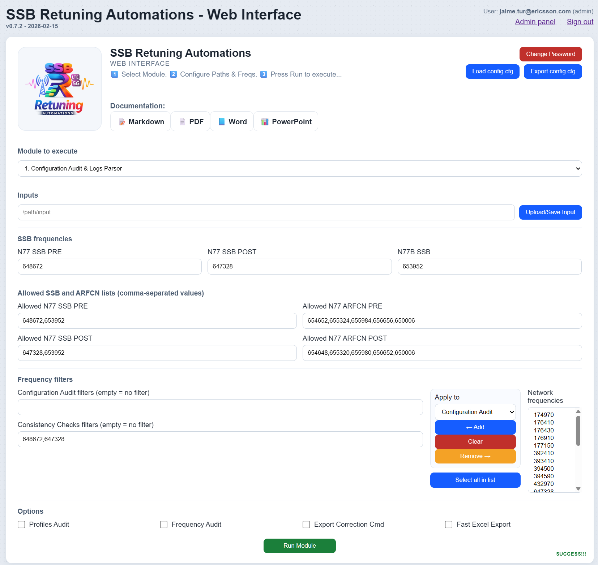
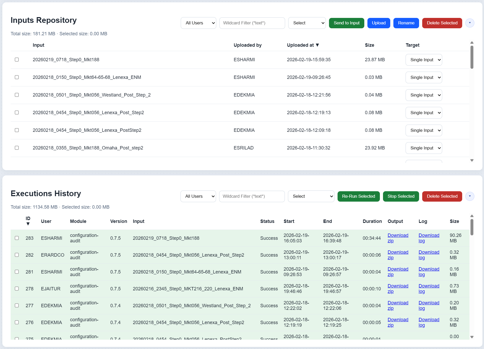
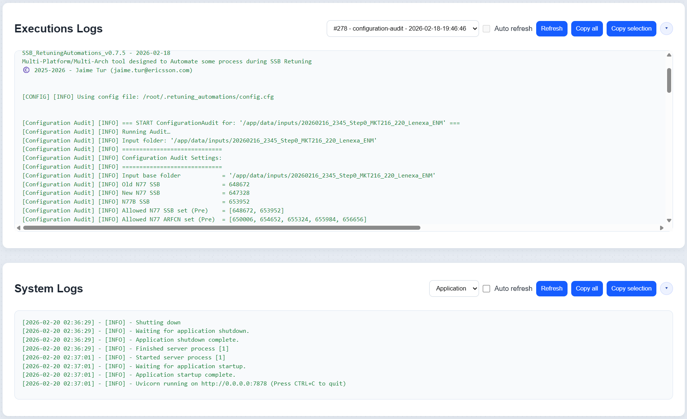
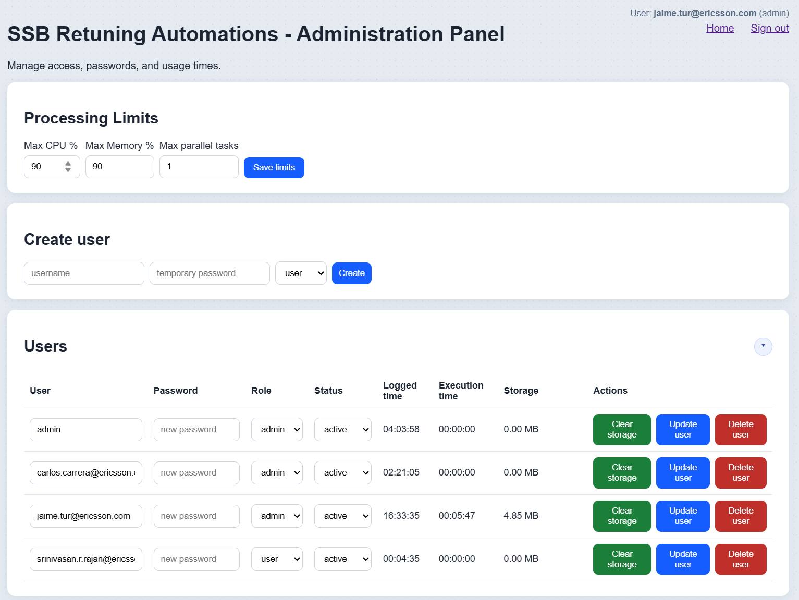
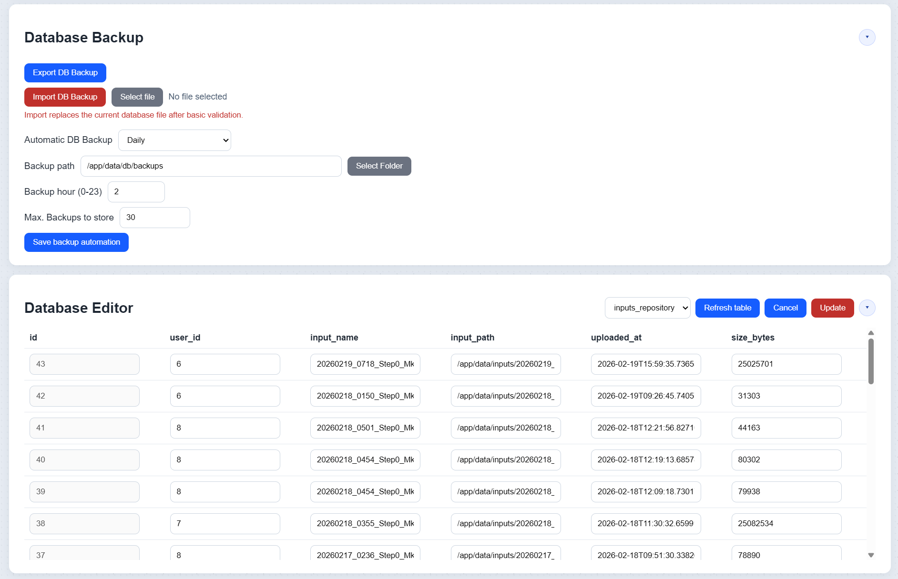

# Technical User Guide — SSB Retuning Automations

## 1) Service Overview

SSB Retuning Automations parses network logs, performs ConfigurationAudit checks, optionally compares PRE/POST states with ConsistencyChecks, and generates Excel deliverables and correction command exports.

This document provides the official user-facing documentation for the SSB Retuning Automations tool. It explains how to prepare inputs, how each module behaves, which execution modes are available, and how to interpret all generated outputs.

### 1.1 Coexistence of old & new SSB:
Coexistence of old/new SSB will split UE measurements in 2 frequencies. A cell ranked 3rd might become 1st after the split, increasing the risk of connecting to overshooting cells. 
- To handle this, suggest setting lower priority for the SSB not collocated to minimize potential issues due to overshooting
- Retune cluster sites with low priority to old SSB (priority change on Step2)
- Neighboring sites with low priority to new SSB
- UEs camping on neighboring sites to retune cluster will not try to reselect or add ENDC on new SSB (lower priority)
- UEs camping on border sites in retune cluster will not try to reselect or add ENDC on old SSB (lower priority)
- Step1 will add FreqRelation to new SSB in retune + neighboring clusters 
- Step2 will not remove FreqRelation to old SSB
- ENDC and Mobility allowed in border and neighboring sites with existing CellRelations

### 1.2 Clusters definition and pre-checks

- Relations with old and new SSB will coexist in some nodes for a certain period, in some cases making intra-frequency relations become inter-frequency relations with impact on NR and ENDC mobility. Inter-frequency mobility will not be started until serving cell will go below a certain level entering the search zone, that might not be reached in locations that used to trigger intra-frequency mobility towards a best server. In addition, once the UE starts to measure either in idle or connected mode, the old and new SSBs will be reported in 2 separate frequencies and a cell ranked 3rd might become 1st after the split, creating the risk of connecting to cells suffering high interference. 
- The amount and duration of such situations will depend on the retune clusterization and planning that should be aimed at minimizing the old and new SSB borders.
- Mobility optimizations might be recommended to mitigate the impact on KPIs such as drop rate.
- Full audit needed to evaluate the number of MOs and anticipate any additions that might be needed to the scripts for different markets.
- Detect if any MOs exceeding the allowed cardinality adding the new SSB definitions: 
  - Max NRFrequency definitions per node (limit 64)
  - Max NRFreqRelation per NR cell (limit 16)
  - Max GUtranSyncSignalFrequency definitions per node (limit 24)
  - Max GUtranFreqRelation per LTE cell (limit 16)
- Identify retune+border clusters with markets being planned on different nights 

### 1.3 Process: Initial network audit + Two Steps approach + Final Clean-Up

#### Step0, initial network audit
- Pre-checks export with all relevant MOs and params in retune+border clusters, including cellRelation. Evaluate the number of MOs and anticipate any additions that might be needed to the scripts for different markets

#### Step1, before SSB retune including neighboring sites
- Retune readiness in retune + neighboring clusters
- Following the clusterization and planning phase, there would be a first step preparing the network for the coexistence of old and new SSBs. 
- New GUtranSyncSignalFrequency/GUtranFreqRelation and NRFrequency/NRFreqRelation instances following VZ naming convention added manually before SSB retune. Nodes of all NR and LTE bands with FreqRelations to the retuned frequency are considered
- NrFreqRel profiles containing new SSB names
- Low PRIO for new SSB: endcB1MeasPriority 2->1, to mitigate the impact in retune borders
- Add new SSB to FreqPrioNR 

#### Step2, SSB retune cluster
- Finally, in the second step we will proceed with the SSB retune in the retune clusters.
- SSB retune NR N77 cells in a cluster
- NrCell, NrFreqRel and EUtranFreqRel profiles containing new SSB names
- Replace old SSB on EndcDistrProfile gUtranFreqRef and MandatoryGUtranFreqRef
- Normal PRIO for new SSB: endcB1MeasPriority 2
- Low PRIO for old SSB: endcB1MeasPriority 2->1, to mitigate the impact in retune borders
- Step2 Cleanup, Relations and ExternalCell that failed to update automatically
  - Lock/unlock Termpoints
  - Set ExternalCell Frequency
  - Delete and re-create CellRelations
  - Remove CellRelations that ANR might have added due to outage during SSB retune

#### Final Cleanup (after all clusters done in a region and no borders with old SSB)
- There should not be any CellRelation pointing to old SSB Freq
- Remove old SSB GUtranSyncSignalFrequency/GUtranFreqRelation and NRFrequency/NRFreqRelation
- Remove NrCell, NrFreqRel and EUtranFreqRel profiles containing old SSB names

### 1.5 Retune process roadmap

## 2) SSB Retuning Automations - Overview

### 2.1 Structure and Inputs/Outputs

#### Structure
- **SSB Retuning Automations** is an automation platform for SSB retuning projects that can run in GUI or CLI mode or through a Web Interface (using a server/client infrastructure) and orchestrates five functional modules:
  - **Module 0**: Update Network Frequencies.
  - **Module 1**: Configuration Audit & Logs Parser.
  - **Module 2**: Consistency Check (manual Pre/Post).
  - **Module 3**: Consistency Check Bulk (automatic Pre/Post detection by market).
  - **Module 4**: Final Clean-Up.
- The main execution lives in `src/SSB_RetuningAutomations.py`, where CLI arguments, GUI, configuration persistence, input resolution (folders/ZIP), per-module execution, and artifact versioning are managed.

#### Inputs
Inputs are folders (or ZIP archives) containing log files. The tool parses the logs into MO tables and runs checks on them. For ConsistencyChecks, provide either explicit PRE and POST folders or a single root folder where PRE/POST runs can be auto-detected.

#### Outputs
Each module generates a dedicated output folder containing Excel reports, logs, and optional correction command exports.

---

### 2.2 Repository architecture, Execution modes and Versioning

#### Orchestration core
- `src/SSB_RetuningAutomations.py`: entry point, CLI/GUI parsing, module routing, batch/bulk execution, and versioning.

#### Main modules files
- `src/modules/ConfigurationAudit/ConfigurationAudit.py`: log parsing and audit workbook construction (Excel + PPT).
- `src/modules/ConfigurationAudit/ca_summary_excel.py`: assembly of `SummaryAudit` and discrepancy dataframes.
- `src/modules/ConsistencyChecks/ConsistencyChecks.py`: PRE/POST loading, relation comparison, discrepancies, and output export.
- `src/modules/ProfilesAudit/ProfilesAudit.py`: profiles audit (integrated into module 1).
- `src/modules/CleanUp/FinalCleanUp.py`: final clean-up (base implementation for extension).

#### Common layer and utilities
- `src/modules/Common/*.py`: correction command logic and shared functions.
- `src/utils/*.py`: IO, parsing, frequency handling, Excel, pivots, sorting, infrastructure, and timing.

#### Execution modes
- The tool can be run in three different modes:
  - **GUI mode**: run without CLI arguments.
  - **CLI mode**: run with explicit module and options.
  - **Web Interfacee**: the tool can be run in a server/client infrastructure, accessing the server through a Web Interface where you can unpload your inputs, enqueue different tasks and  export the results when finish..

#### Versioning
- All Generated artifacts include a versioned suffix: `<timestamp>_v<TOOL_VERSION>`. This guarantees traceability and avoids collisions between runs.

---

## 3) SSB Retuning Automations - Interfaces 

### Graphical User Interface - GUI Panel

- This is the main Graphical User Interface for SSB Retuning Automations.. From this panel you can select the modules you want to run and the inputs you want to provide.
- You can also configure some settings like the network frequencies to use or the Input folder to use.
- The tool will then run the selected modules and generate the outputs.

### Web Interface - User Section

- This is the main Web Interface for SSB Retuning Automations. From this panel you can select the modules you want to run and the inputs you want to provide.
- You can also configure some settings like the network frequencies to use or the Input folder to use.
- The tool will then run the selected modules and generate the outputs.

### Web Interface - Inputs Repository Panel

- You can see some information about the Inputs Repository.

### Web Interface - Executions and System Logs Panels

- You can see some information about Last Executions and some useful System Logs of the tool.

### Web Interface - Admin Section

- This is the main Administrator Panel for SSB Retuning Automations. From this panel you can manage the configuration of the tool, view logs and manage user access.

### Web Interface - Database Management Panels

- With those panels you can manage the database of the tool, schedule backups tasks, or edit the database content directly.

### Web FastAPI Interface

- The tool also supports a Web FastAPI interface when the Web server is launched.
- With this interface you can do almost all the tasks using different endpoints.
- All the endpoints are documented in `/api` endpoint of your Web server url. i.e: 127.0.0.1:7878/api (assuming that you have your Web server running in your localhost and configured in port 7878).

### Command Line Interface - CLI

With the CLI you can run the modules you want to run and provide all different arguments you need.

 ▶️ Basic Syntax:

- **SSB_RetuningAutomations.exe --module <module-name> [options]**

- If `--module` is omitted and **no other arguments** are provided, the GUI will launch automatically unless `--no-gui` is specified.

⚙️ Main Options:

| Argument     | Description                                                                                                                |
|--------------|----------------------------------------------------------------------------------------------------------------------------|
| --module     | Module to run: [`configuration-audit`, `consistency-check`, `consistency-check-bulk`, `final-cleanup`]                     |
| --input      | Input folder to process (single-input modules)                                                                             |
| --inputs     | Input folders to process module in batch mode. Example: `--module configuration-audit --inputs dir1 dir2 dir3`             |
| --input-pre  | PRE input folder (only for `consistency-check`)                                                                            |
| --input-post | POST input folder (only for `consistency-check`)                                                                           |
| --output     | Output root folder override (all modules). The tool still creates the same module/version subfolder logic under this root. |

| Argument                 | Description                                                                                                                                                                |
|--------------------------|----------------------------------------------------------------------------------------------------------------------------------------------------------------------------|
| --n77-ssb-pre`           | N77 SSB frequency before refarming (Pre), e.g. `647328`                                                                                                                    |
| --n77-ssb-post           | N77 SSB frequency after refarming (Post), e.g. `653952`                                                                                                                    |
| --n77b-ssb               | N77B SSB frequency (ARFCN), e.g. `650334`                                                                                                                                  |
| --allowed-n77-ssb-pre    | Comma-separated allowed N77 SSB (Pre) values for Configuration Audit                                                                                                       |
| --allowed-n77-arfcn-pre  | Comma-separated allowed N77 ARFCN (Pre) values for Configuration Audit                                                                                                     |
| --allowed-n77-ssb-post   | Comma-separated allowed N77 SSB (Post) values for Configuration Audit                                                                                                      |
| --allowed-n77-arfcn-post | Comma-separated allowed N77 ARFCN (Post) values for Configuration Audit                                                                                                    |
| --ca-freq-filters        | Comma-separated list of frequency substrings to filter pivot columns in Configuration Audit module                                                                         |
| --cc-freq-filters        | Comma-separated list of frequency substrings to filter relations in Consistency Check module                                                                               |
| --frequency-audit        | Enable/disable Frequency Audit (integrated into Configuration Audit). Default Value: Enabled (use `--no-frequency-audit` to disable it)                                    |
| --profiles-audit         | Enable/disable Profiles Audit (integrated into Configuration Audit). Default Value: Enabled (use `--no-profiles-audit` to disable it)                                      |
| --export-correction-cmd  | Enable/disable exporting correction command to text files (slow). Default Value: Enabled (use `--no-export-correction-cmd` to disable it).                                 |
| --fast-excel             | Enable/disable fast Excel export using xlsxwriter engine (reduced formatting features if compared to openpyxl). Default Value: Disabled (use `--fast-excel` to enable it). |

---

## 4) SSB Retuning Automations - Modules Included

### 4.1 Module 0 — Update Network Frequencies

#### Input
- Input folder (may contain subfolders/ZIPs already supported by the IO layer).
- Mo logs with an `NRFrequency` table and the `arfcnValueNRDl` column.

#### Process
1. Scan logs and detects `NRFrequency` blocks.
2. Extracts numeric values from `arfcnValueNRDl`.
3. Removes duplicates and sorts frequencies.
4. Updates the persisted “Network frequencies” configuration for GUI/CLI.

#### Output
- Does not generate Excel/PPT.
- Updates the persisted network frequency value used for filtering and selection in later runs.

#### Detailed implementation notes
- The module reuses the same input resolver used by the other modules (`ensure_logs_available`), so it can consume either plain folders or folders containing ZIPs without changing operator workflow.
- It scans **all** detected logs, slices each `SubNetwork` block, and processes only blocks where MO name is exactly `NRFrequency`.
- Inside each `NRFrequency` block, it reads `arfcnValueNRDl`, keeps only strictly numeric values, deduplicates, and sorts numerically.
- The resulting list is persisted to `config.cfg` in `network_frequencies` and also loaded in-memory into the `NETWORK_FREQUENCIES` global list.
- In practice, this module should be executed after collecting representative logs from the network and then only when new frequencies are introduced. For stable markets, running it once is usually enough.

#### Impact on GUI and Web Interface
- **Desktop GUI**: when launching in GUI mode (no CLI args), the app loads `network_frequencies` from `config.cfg` and uses that list as the selectable values shown to users.
- **Web Interface**: the backend endpoint loading defaults first tries persisted `network_frequencies`; if empty, it falls back to parsing the hardcoded defaults from `SSB_RetuningAutomations.py`.
- This means Module 0 is the canonical mechanism to keep both interfaces aligned with real network frequency inventory.

---

### 4.2 Module 1 — Configuration Audit & Logs Parser

ConfigurationAudit performs a detailed validation of a single configuration snapshot. It parses network logs, builds Managed Object (MO) tables, and evaluates multiple consistency and retuning-related rules.  

ConfigurationAudit validates frequency configuration (SSB/ARFCN), relations, externals, TermPoints, profiles, and cardinality constraints. Results are consolidated in the SummaryAudit sheet.

#### Execution Modes
ConfigurationAudit can be executed in two main modes:
-	Normal mode: The user provides a single input folder. The tool runs all checks and generates one audit output.
-	Batch mode: The user provides a root folder containing multiple Step0 runs. The tool automatically detects valid runs and executes ConfigurationAudit for each one.

#### Inputs
- Input folder with MOs logs (`.log`, `.logs`, `.txt`) or ZIPs resolvable by utilities.
- Frequency parameters:
  - `n77_ssb_pre`
  - `n77_ssb_post`
  - `n77b_ssb`
  - allowed SSB/ARFCN lists pre/post.
- Flags:
  - `profiles_audit`
  - `frequency_audit`
  - `export_correction_cmd`
  - `fast_excel_export`.

#### Process
1. Parses files and extracts MO tables by `SubNetwork` blocks.
2. Generates one sheet per detected table.
3. Builds `SummaryAudit` + pivots/auxiliary summaries.
4. Runs profiles audit if enabled.
5. Exports CA correction commands if requested.
6. Generates the summary PPT.

#### Outputs
- Folder `ConfigurationAudit_<timestamp>_v<version>/`.
- Excel file `ConfigurationAudit_<timestamp>_v<version>.xlsx`:
  - Sheets for each parsed MO table.
  - Sheet with a `SummaryAudit` sheet wich contains the audit results.
  - NR/LTE parameter discrepancy sheets.
  - Summary/pivot sheets by frequencies and relations.
- PPT file `ConfigurationAudit_<timestamp>_v<version>.pptx`.
- Optional folder `Correction_Cmd_CA/` with AMOS commands.

#### Main semantic content
- **SummaryAudit** contains rows with:
  - `Category`, `SubCategory`, `Metric`, `Value`, `ExtraInfo`,
  - and execution context fields (stage, module, etc. depending on the flow).
- `Value` usually represents a count of impacted nodes/cells/relations.
- `ExtraInfo` contains the NodeId list or a compact discrepancy detail.

---

### 4.3 Module 2 — Consistency Check (manual Pre/Post)

ConsistencyChecks compares PRE and POST relation tables (NRCellRelation and GUtranCellRelation). The comparison uses a stable key per relation (e.g., NodeId + CellId + RelationId).  

The module detects missing relations, new relations, and discrepancies (parameter differences and frequency differences). Results are summarized in the comparison Excel.

#### Execution Modes
-	Normal (manual PRE/POST): The user explicitly provides PRE and POST input folders.
-	Batch (auto-detected PRE/POST):The user provides a root folder. The tool automatically selects PRE and POST runs based on timestamps and naming rules.

#### Inputs
- `input_pre` and `input_post` folders. Both folders should contains MOs logs (`.log`, `.logs`, `.txt`) or ZIPs resolvable by utilities.
- Frequencies `n77_ssb_pre` and `n77_ssb_post`.
- Optional reference to PRE and POST `ConfigurationAudit` to enrich target classification.
- Optional list of frequency filters (`cc_freq_filters`).

#### Process
1. Loads relation tables (`GUtranCellRelation`, `NRCellRelation`).
2. Normalizes columns/keys and selects the most recent snapshots by date.
3. Detect:
   - new relations,
   - missing relations,
   - parameter discrepancies,
   - frequency discrepancies,
   - summary by PRE/POST frequency pair.
4. Classify destination targets as `SSB-Pre`, `SSB-Post` or `Unknown`.
5. Exports detailed Excel outputs and correction commands.

#### Outputs
- `CellRelation_<timestamp>_v<version>.xlsx` (end-to-end relations view).
- `ConsistencyChecks_CellRelation_<timestamp>_v<version>.xlsx` with:
  - `Summary`
  - `SummaryAuditComparisson` (if there is PRE/POST SummaryAudit)
  - `Summary_CellRelation`
  - GU blocks: `GU_relations`, `GU_param_disc`, `GU_freq_disc`, `GU_freq_disc_unknown`, `GU_missing`, `GU_new`
  - NR blocks: `NR_relations`, `NR_param_disc`, `NR_freq_disc`, `NR_freq_disc_unknown`, `NR_missing`, `NR_new`
  - optional `GU_all`, `NR_all`.
- `Correction_Cmd_CC/` with commands per type (new/missing/discrepancies).

#### Missing Relations
A relation is classified as MISSING in POST when its key exists in PRE but does not exist in POST. In code terms: Missing = PRE_keys − POST_keys.

#### New Relations
A relation is classified as NEW in POST when its key exists in POST but does not exist in PRE. In code terms: New = POST_keys − PRE_keys.

#### Parameters Discrepancies
A relation is classified as a DISCREPANCY when the key exists in both PRE and POST, but one or more audited parameters differ. The tool compares shared columns, excluding technical columns (Pre/Post, Date), key columns, and the detected frequency column.

#### Frequency Discrepancies (SSB)
Frequency discrepancies are identified by extracting a normalized base frequency (Freq_Pre / Freq_Post) and applying retuning rules. Typical rule: if a relation has the target frequency in PRE (or already has POST) but POST does not contain the expected POST frequency, it is flagged for frequency discrepancy handling

---

### 4.4 Module 3 — Consistency Check Bulk (automatic Pre/Post detection by market)

#### Inputs
- Root folder with subfolders like `yyyymmdd_hhmm_step0` (optionally nested by market).

#### Process
1. Detects PRE/POST candidates by the most appropriate date/time.
2. Excludes folders using a blacklist (`ignore`, `old`, `bad`, `partial`, `incomplete`, `discard`, etc.).
3. Runs Module 2 for each detected market.

#### Outputs
- Same output structure as module 2, per market.
- Traceability file `FoldersCompared.txt`.

---

### 4.5 Module 4 — Final Clean-Up

#### Inputs
- Final retune working folder.

#### Process
- Executes final cleanup policies (structure prepared to expand rules).

#### Outputs
- Versioned cleanup directory according to the active implementation.

---

## 5) Configuration Audit module in detail

### 5.1 SummaryAudit checks philosophy
SummaryAudit sheet contains a high-level checks table by categories. The flow:
1. Excludes `UNSYNCHRONIZED` nodes based on `MeContext`.
2. Evaluates NR, LTE, ENDC, Externals, TermPoints, cardinalities, and profiles.
3. Records each check as a row (`Category/SubCategory/Metric/Value/ExtraInfo`).

### 5.2 Operational meaning of SummaryAudit rows
- **Category**: audited technical domain (NR/LTE/ENDC/MeContext/etc.).
- **SubCategory**: type of analysis (Audit/Inconsistencies/Profiles).
- **Metric**: specific rule evaluated.
- **Value**:
  - Integer: number of affected nodes/relations/cells.
  - `N/A`: not evaluable due to missing columns.
  - Text: captured status or error.
- **ExtraInfo**: list of nodes or bounded detail for troubleshooting.

### 5.3 SummaryAudit checks catalog

### A) MeContext Audit
**Source tables**: `MeContext`.

Main checks:
- Total unique nodes.
- Nodes with syncStatus='UNSYNCHRONIZED' (excluded from the rest of the audits).

**Complete Checks List**:

| Category  | SubCategory     | Metric                                                                | Tips                                                        |
|-----------|-----------------|-----------------------------------------------------------------------|-------------------------------------------------------------|
| MeContext | MeContext Audit | Total unique nodes                                                    | MeContext table to create lists of sites for implementation |
| MeContext | MeContext Audit | Nodes with syncStatus='UNSYNCHRONIZED' (being excluded in all Audits) | Unsynch nodes excluded in Audits and Implementation         |

### B) NR Frequency Audit / NR Frequency Inconsistencies
**Source tables**: `NRCellDU`, `NRFrequency`, `NRFreqRelation`, `NRSectorCarrier`, `NRCellRelation`, `ExternalNRCellCU`, `TermPointToGNodeB`, `TermPointToGNB`.

Main checks:
- Detection of NR nodes with N77 SSB (band 646600–660000).
- Classification of NR nodes as LowMidBand / mmWave / mixed.
- Nodes whose N77 SSBs are fully within allowed PRE or POST lists.
- Nodes with N77 SSB outside allowed lists.
- Old/new SSB presence per node (only old, only new, both).
- Nodes with NRFreqRelationId in an unexpected format (auto-created outside convention).
- NR relations to old/new SSB.
- NR externals and termpoints pointing to old/new/unknown.

**Typical triggering**:
- Each check is enabled if the table and minimum required columns exist.
- If columns are missing, a `N/A` status row is added.
- If the table is empty or not found, an informative row `Table not found or empty` is added.

**Interpretation**:
- `Value > 0` in inconsistencies indicates a real deviation that requires investigation.
- `ExtraInfo` typically lists affected nodes for operational targeting.

**Complete Checks List**:

| Category         | SubCategory                  | Metric                                                                                                                                                 | Tips                                                                                       |
|------------------|------------------------------|--------------------------------------------------------------------------------------------------------------------------------------------------------|--------------------------------------------------------------------------------------------|
| NRCellDU         | NR Frequency Audit           | NR Nodes with ssbFrequency                                                                                                                             |                                                                                            |
| NRCellDU         | NR Frequency Audit           | NR LowMidBand Nodes                                                                                                                                    |                                                                                            |
| NRCellDU         | NR Frequency Audit           | NR mmWave Nodes                                                                                                                                        |                                                                                            |
| NRCellDU         | NR Frequency Audit           | NR nodes with N77 SSB in band (646600-660000)                                                                                                          |                                                                                            |
| NRCellDU         | NR Frequency Audit           | NR nodes with N77 SSB in Pre-Retune allowed list (648672, 653952)                                                                                      | Nodes with N77A Step2b pending                                                             |
| NRCellDU         | NR Frequency Audit           | NR nodes with N77 SSB in Post-Retune allowed list (647328, 653952)                                                                                     | Nodes with N77A Step2b completed                                                           |
| NRCellDU         | NR Frequency Inconsistencies | NR nodes with N77 SSB not in Pre/Post Retune allowed lists                                                                                             | These nodes must be checked in preparation phase and confirm if any special action needed  |
| NRSectorCarrier  | NR Frequency Audit           | NR nodes with N77 ARCFN in band (646600-660000)                                                                                                        |                                                                                            |
| NRSectorCarrier  | NR Frequency Audit           | NR nodes with N77 ARCFN in Pre-Retune allowed list (650006, 654652, 655324, 655984, 656656)                                                            | Nodes with N77B Step2b pending                                                             |
| NRSectorCarrier  | NR Frequency Audit           | NR nodes with N77 ARCFN in Post-Retune allowed list (650006, 654648, 655320, 655980, 656652)                                                           | Nodes with NttB Step2b completed                                                           |
| NRSectorCarrier  | NR Frequency Inconsistencies | NR nodes with N77 ARCFN not in Pre/Post Retune allowed lists                                                                                           | These nodes must be checked in preparation phase and confirm if any special action needed  |
| NRFreqRelation   | NR Frequency Audit           | NR nodes with the old N77 SSB (648672)                                                                                                                 |                                                                                            |
| NRFreqRelation   | NR Frequency Audit           | NR nodes with the new N77 SSB (647328)                                                                                                                 |                                                                                            |
| NRFreqRelation   | NR Frequency Audit           | NR nodes with both, the old N77 SSB (648672) and the new N77 SSB (647328)                                                                              | Need to run Step1 on these nodes                                                           |
| NRFreqRelation   | NR Frequency Audit           | NR nodes with the old N77 SSB (648672) but without the new N77 SSB (647328)                                                                            | Need to run Step1 on these nodes                                                           |
| NRFreqRelation   | NR Frequency Audit           | NR nodes with some cells missing relations to new SSB (647328)                                                                                         | Nodes with any relations Step1 pending                                                     |
| NRFreqRelation   | NR Frequency Audit           | NR nodes with the new N77 SSB (647328) NRFreqRelation pointing to mcpcPCellNrFreqRelProfileRef containing new SSB name (cloned) or Other               | Nodes with Step1 completed                                                                 |
| NRFreqRelation   | NR Frequency Inconsistencies | NR nodes with the N77 SSB not in (648672, 647328)                                                                                                      |                                                                                            |
| NRFreqRelation   | NR Frequency Inconsistencies | NR nodes with Auto-created NRFreqRelationId to new N77 SSB (647328) but not following VZ naming convention (e.g. with extra characters: 'auto_647328') |                                                                                            |
| NRFreqRelation   | NR Frequency Inconsistencies | NR Nodes with the new N77 SSB (647328) and NRFreqRelation reference to McpcPCellNrFreqRelProfile with old SSB before '_' (648672_xxxx)                 | Need to review Step2b execution                                                            |
| NRFreqRelation   | NR Frequency Inconsistencies | NR nodes with the old N77 SSB (648672) and the new SSB (647328) NRFreqRelation pointing to same mcpcPCellNrFreqRelProfileRef containing old SSB name   | Need to run Step1 on these nodes                                                           |
| NRFreqRelation   | NR Frequency Inconsistencies | NR nodes with mismatching params (cell-level) between old N77 SSB (648672) and the new N77 SSB (647328)                                                | Need to review. Step1 run could solve most cases                                           |
| NRCellRelation   | NR Frequency Audit           | NR cellRelations to old N77 SSB (648672)                                                                                                               | Post Step2 some relations pointing to other Mkts could be on old SSB. See details in table |
| NRCellRelation   | NR Frequency Audit           | NR cellRelations to new N77 SSB (647328)                                                                                                               |                                                                                            |
| ExternalNRCellCU | NR Frequency Audit           | External cells to old N77 SSB (648672)                                                                                                                 | PN and DAS might have no External relations defined                                        |
| ExternalNRCellCU | NR Frequency Audit           | External cells to new N77 SSB (647328)                                                                                                                 | PN and DAS might have no External relations defined                                        |

### C) LTE Frequency Audit / LTE Frequency Inconsistencies
**Source tables**: `GUtranSyncSignalFrequency`, `GUtranFreqRelation`, `GUtranCellRelation`, `ExternalGUtranCell`, `TermPointToENodeB`.

Main checks:
- LTE nodes with old/new SSB.
- Nodes with both old/new or old without new.
- SSB outside the expected pre/post set.
- LTE relations to old/new and parameter discrepancies per cell relation.
- LTE externals OUT_OF_SERVICE for old/new.

**Complete Checks List**:

| Category           | SubCategory                   | Metric                                                                                                                             | Tips                                                                                                                                                                                                         |
|--------------------|-------------------------------|------------------------------------------------------------------------------------------------------------------------------------|--------------------------------------------------------------------------------------------------------------------------------------------------------------------------------------------------------------|
| GUtranFreqRelation | LTE Frequency Audit           | LTE nodes with the old N77 SSB (648672)                                                                                            |                                                                                                                                                                                                              |
| GUtranFreqRelation | LTE Frequency Audit           | LTE nodes with the new N77 SSB (647328)                                                                                            |                                                                                                                                                                                                              |
| GUtranFreqRelation | LTE Frequency Audit           | LTE nodes with both, the old N77 SSB (648672) and the new N77 SSB (647328)                                                         | Nodes with Step1 completed                                                                                                                                                                                   |
| GUtranFreqRelation | LTE Frequency Audit           | LTE nodes with the old N77 SSB (648672) but without the new SSB (647328)                                                           | Need to run Step1 on these nodes                                                                                                                                                                             |
| GUtranFreqRelation | LTE Frequency Audit           | LTE nodes with some cells missing relations to new SSB (647328)                                                                    | Need to run Step1 on these nodes                                                                                                                                                                             |
| GUtranFreqRelation | LTE Frequency Inconsistencies | LTE nodes with the N77 SSB not in (648672, 647328)                                                                                 |                                                                                                                                                                                                              |
| GUtranFreqRelation | LTE Frequency Inconsistencies | LTE nodes with Auto-created GUtranFreqRelationId to new N77 SSB (647328) but not following VZ naming convention (647328-30-20-0-1) | Not an issue, unless other inconsistencies raised                                                                                                                                                            |
| GUtranFreqRelation | LTE Frequency Inconsistencies | LTE nodes with same endcB1MeasPriority in old N77 SSB (648672) and new N77 SSB (647328)                                            | Need to review and fix with Step1 or Step2c                                                                                                                                                                  |
| GUtranFreqRelation | LTE Frequency Inconsistencies | LTE nodes with mismatching params between GUtranFreqRelationId 648672 and 647328                                                   | Parameters qQualMin, qRxLevMin, threshXHigh agreed to set to fixed values on new freqs and inconsistencies should be reported to VZ. Other inconsistent parameters would require review for further actions. |
| GUtranCellRelation | LTE Frequency Audit           | LTE cellRelations to old N77 SSB (648672)                                                                                          | Post Step2 some relations pointing to other Mkts could be on old SSB. See details in table                                                                                                                   |
| GUtranCellRelation | LTE Frequency Audit           | LTE cellRelations to new N77 SSB (647328)                                                                                          |                                                                                                                                                                                                              |
| ExternalGUtranCell | LTE Frequency Audit           | External cells to old N77 SSB (648672)                                                                                             | Post Step2 some relations pointing to other Mkts could be on old SSB. See details in table                                                                                                                   |
| ExternalGUtranCell | LTE Frequency Audit           | External cells to new N77 SSB (647328)                                                                                             |                                                                                                                                                                                                              |
| ExternalGUtranCell | LTE Frequency Audit           | External cells to old N77 SSB (648672) with serviceStatus=OUT_OF_SERVICE                                                           | Externals with unavailable TermPoints are not operational for ENDC and might not be updated immediately after Step2                                                                                          |
| ExternalGUtranCell | LTE Frequency Audit           | External cells to new N77 SSB (647328) with serviceStatus=OUT_OF_SERVICE                                                           |                                                                                                                                                                                                              |

### D) Termpoint Audit / Termpoint Inconsistencies
**Source tables**: `TermPointToGNodeB`, `TermPointToENodeB`, `TermPointToGNB`.

**Complete Checks List**:

| Category          | SubCategory        | Metric                                               | Tips                                     |
|-------------------|--------------------|------------------------------------------------------|------------------------------------------|
| TermPointToGNodeB | NR Termpoint Audit | NR to NR TermPoints with administrativeState=LOCKED  |                                          |
| TermPointToGNodeB | NR Termpoint Audit | NR to NR TermPoints with operationalState=DISABLED   |                                          |
| TermPointToENodeB | X2 Termpoint Audit | NR to LTE TermPoints with administrativeState=LOCKED | Helpful to troubleshoot External updates |
| TermPointToENodeB | X2 Termpoint Audit | NR to LTE TermPoints with operationalState=DISABLED  | Helpful to troubleshoot External updates |
| TermPointToGNB    | X2 Termpoint Audit | LTE to NR TermPoints with administrativeState=LOCKED | Helpful to troubleshoot External updates |
| TermPointToGNB    | X2 Termpoint Audit | LTE to NR TermPoints with operationalState=DISABLED  | Helpful to troubleshoot External updates |
| TermPointToGNB    | X2 Termpoint Audit | LTE to NR TermPoints with usedIpAddress=0.0.0.0/::   | Helpful to troubleshoot External updates |

### E) ENDC Audit / ENDC Inconsistencies
**Source tables**: `EndcDistrProfile`, `FreqPrioNR`.

Main checks:
- `gUtranFreqRef` and `mandatoryGUtranFreqRef` with old/new + N77B combinations.
- Nodes that do not contain the expected frequency combination.
- In `FreqPrioNR`: old without new, both present, and parameter mismatch per cell.

**Complete Checks List**:

| Category         | SubCategory          | Metric                                                                                                                     | Tips                                                                                      |
|------------------|----------------------|----------------------------------------------------------------------------------------------------------------------------|-------------------------------------------------------------------------------------------|
| EndcDistrProfile | ENDC Audit           | Nodes with gUtranFreqRef containing the old N77 SSB (648672) and the N77B SSB (653952)                                     | Need to run Step2c on this nodes                                                          |
| EndcDistrProfile | ENDC Audit           | Nodes with gUtranFreqRef containing the new N77 SSB (647328) and the N77B SSB (653952)                                     | Nodes with Step2c completed                                                               |
| EndcDistrProfile | ENDC Audit           | Nodes with mandatoryGUtranFreqRef containing the old N77 SSB (648672) and the N77B SSB (653952)                            | Need to run Step2c on this nodes                                                          |
| EndcDistrProfile | ENDC Audit           | Nodes with mandatoryGUtranFreqRef containing the new N77 SSB (647328) and the N77B SSB (653952)                            | Nodes with Step2c completed                                                               |
| EndcDistrProfile | ENDC Inconsistencies | Nodes with gUtranFreqRef not containing N77 SSBs (648672 or 647328) together with N77B SSB (653952)                        | Need to run Step1 on this nodes                                                           |
| EndcDistrProfile | ENDC Inconsistencies | Nodes with mandatoryGUtranFreqRef not empty and not containing N77 SSBs (648672 or 647328) together with N77B SSB (653952) | These nodes must be checked in preparation phase and confirm if any special action needed |
| FreqPrioNR       | ENDC Audit           | LTE nodes with the old N77 SSB (648672) but without the new N77 SSB (647328)                                               | Need to run Step1 on this nodes if existing GUtranFreqRelation                            |
| FreqPrioNR       | ENDC Audit           | LTE nodes with both, the old N77 SSB (648672) and the new N77 SSB (647328)                                                 | Nodes with Step1 completed                                                                |
| FreqPrioNR       | ENDC Audit           | NR nodes with RATFreqPrioId = 'fwa' in N77 band                                                                            |                                                                                           |
| FreqPrioNR       | ENDC Audit           | NR nodes with RATFreqPrioId = 'publicsafety' in N77 band                                                                   |                                                                                           |
| FreqPrioNR       | ENDC Inconsistencies | LTE nodes with mismatching params (cell-level) between FreqPrioNR 648672 and 647328                                        |                                                                                           |
| FreqPrioNR       | ENDC Inconsistencies | NR nodes with RATFreqPrioId different from 'fwa'/'publicsafety' in N77 band                                                | These nodes must be checked in preparation phase and confirm if any special action needed |

### F) Cardinalities Audit / Inconsistencies
Cardinality checks per relation table (per node and/or per cell) to detect overprovisioning or gaps versus expected limits.

**Complete Checks List**:

| Category                              | SubCategory                   | Metric                                                           | Tips                                                                                      |
|---------------------------------------|-------------------------------|------------------------------------------------------------------|-------------------------------------------------------------------------------------------|
| Cardinality NRFrequency               | Cardinality Audit             | Max NRFrequency definitions per node (limit 64)                  | These nodes must be checked in preparation phase and confirm if any special action needed |
| Cardinality NRFrequency               | Cardinality Inconsistencies   | NR nodes with NRFrequency definitions at limit 64                | These nodes must be checked in preparation phase and confirm if any special action needed |
| Cardinality NRFreqRelation            | Cardinality Audit             | Max NRFreqRelation per NR cell (limit 16)                        | These cells must be checked in preparation phase and confirm if any special action needed |
| Cardinality NRFreqRelation            | Cardinality Inconsistencies   | NR cells with NRFreqRelation count at limit 16                   | These cells must be checked in preparation phase and confirm if any special action needed |
| Cardinality GUtranSyncSignalFrequency | Cardinality Audit             | Max GUtranSyncSignalFrequency definitions per node (limit 24)    | These nodes must be checked in preparation phase and confirm if any special action needed |
| Cardinality GUtranSyncSignalFrequency | Cardinality Inconsistencies   | LTE nodes with GUtranSyncSignalFrequency definitions at limit 24 | These nodes must be checked in preparation phase and confirm if any special action needed |
| Cardinality GUtranFreqRelation        | Cardinality Audit             | Max GUtranFreqRelation per LTE cell (limit 16)                   | These cells must be checked in preparation phase and confirm if any special action needed |
| Cardinality GUtranFreqRelation        | Cardinality Inconsistencies   | LTE cells with GUtranFreqRelation count at limit 16              | These cells must be checked in preparation phase and confirm if any special action needed |

### G) Profiles Audit (if enabled)
- Compares PRE/POST profiles by supported profile MO.
- Detects parameter discrepancies between old/new variants.
- Adds results to SummaryAudit and auxiliary detail sheets.

**Complete Checks List**:

| Category                           | SubCategory              | Metric                                                                                                     | Tips                                                     |
|------------------------------------|--------------------------|------------------------------------------------------------------------------------------------------------|----------------------------------------------------------|
| McpcPCellNrFreqRelProfileUeCfg     | Profiles Inconsistencies | Profiles with old N77 SSB (xxxx_648672) but not new N77 SSB (xxxx_647328)                                  | Need to review profile consistency before/after retune   |
| McpcPCellNrFreqRelProfileUeCfg     | Profiles Inconsistencies | Retuned nodes and Profiles with old N77 SSB (648672_xxxx) but not new N77 SSB (647328_xxxx)                | Need to review profile consistency before/after retune   |
| McpcPCellNrFreqRelProfileUeCfg     | Profiles Discrepancies   | Retuned nodes and Profiles with old N77 SSB (648672) and new N77 SSB (647328) but with param discrepancies | Need to review profile discrepancies before/after retune |
| TrStSaNrFreqRelProfileUeCfg        | Profiles Inconsistencies | Retuned nodes and Profiles with old N77 SSB (648672_xxxx) but not new N77 SSB (647328_xxxx)                | Need to review profile consistency before/after retune   |
| TrStSaNrFreqRelProfileUeCfg        | Profiles Inconsistencies | Retuned nodes and Profiles with old N77 SSB (648672_xxxx) but not new N77 SSB (647328_xxxx)                | Need to review profile consistency before/after retune   |
| TrStSaNrFreqRelProfileUeCfg        | Profiles Discrepancies   | Retuned nodes and Profiles with old N77 SSB (648672) and new N77 SSB (647328) but with param discrepancies | Need to review profile discrepancies before/after retune |
| McpcPCellProfileUeCfg              | Profiles Inconsistencies | Retuned nodes and Profiles with old N77 SSB (648672) but not new N77 SSB (647328)                          | Need to review profile consistency before/after retune   |
| McpcPCellProfileUeCfg              | Profiles Discrepancies   | Retuned nodes and Profiles with old N77 SSB (648672) and new N77 SSB (647328) but with param discrepancies | Need to review profile discrepancies before/after retune |
| McpcPSCellProfileUeCfg             | Profiles Inconsistencies | Retuned nodes and Profiles with old N77 SSB (648672) but not new N77 SSB (647328)                          | Need to review profile consistency before/after retune   |
| McpcPSCellProfileUeCfg             | Profiles Discrepancies   | Retuned nodes and Profiles with old N77 SSB (648672) and new N77 SSB (647328) but with param discrepancies | Need to review profile discrepancies before/after retune |
| UlQualMcpcMeasCfg                  | Profiles Inconsistencies | Retuned nodes and Profiles with old N77 SSB (648672) but not new N77 SSB (647328)                          | Need to review profile consistency before/after retune   |
| UlQualMcpcMeasCfg                  | Profiles Discrepancies   | Retuned nodes and Profiles with old N77 SSB (648672) and new N77 SSB (647328) but with param discrepancies | Need to review profile discrepancies before/after retune |
| McfbCellProfile                    | Profiles Inconsistencies | Retuned nodes and Profiles with old N77 SSB (648672) but not new N77 SSB (647328)                          | Need to review profile consistency before/after retune   |
| McfbCellProfile                    | Profiles Discrepancies   | Retuned nodes and Profiles with old N77 SSB (648672) and new N77 SSB (647328) but with param discrepancies | Need to review profile discrepancies before/after retune |
| McfbCellProfileUeCfg               | Profiles Inconsistencies | Retuned nodes and Profiles with old N77 SSB (648672) but not new N77 SSB (647328)                          | Need to review profile consistency before/after retune   |
| McfbCellProfileUeCfg               | Profiles Discrepancies   | Retuned nodes and Profiles with old N77 SSB (648672) and new N77 SSB (647328) but with param discrepancies | Need to review profile discrepancies before/after retune |
| TrStSaCellProfile                  | Profiles Inconsistencies | Retuned nodes and Profiles with old N77 SSB (648672) but not new N77 SSB (647328)                          | Need to review profile consistency before/after retune   |
| TrStSaCellProfile                  | Profiles Discrepancies   | Retuned nodes and Profiles with old N77 SSB (648672) and new N77 SSB (647328) but with param discrepancies | Need to review profile discrepancies before/after retune |
| TrStSaCellProfileUeCfg             | Profiles Inconsistencies | Retuned nodes and Profiles with old N77 SSB (648672) but not new N77 SSB (647328)                          | Need to review profile consistency before/after retune   |
| TrStSaCellProfileUeCfg             | Profiles Discrepancies   | Retuned nodes and Profiles with old N77 SSB (648672) and new N77 SSB (647328) but with param discrepancies | Need to review profile discrepancies before/after retune |
| CaCellProfile                      | Profiles Inconsistencies | Retuned nodes and Profiles with old N77 SSB (648672) but not new N77 SSB (647328)                          | Need to review profile consistency before/after retune   |
| CaCellProfile                      | Profiles Discrepancies   | Retuned nodes and Profiles with old N77 SSB (648672) and new N77 SSB (647328) but with param discrepancies | Need to review profile discrepancies before/after retune |
| CaCellProfileUeCfg                 | Profiles Inconsistencies | Retuned nodes and Profiles with old N77 SSB (648672) but not new N77 SSB (647328)                          | Need to review profile consistency before/after retune   |
| CaCellProfileUeCfg                 | Profiles Discrepancies   | Retuned nodes and Profiles with old N77 SSB (648672) and new N77 SSB (647328) but with param discrepancies | Need to review profile discrepancies before/after retune |
| McpcPCellEUtranFreqRelProfile      | Profiles Inconsistencies | Retuned nodes and Profiles with old N77 SSB (648672) but not new N77 SSB (647328)                          | Need to review profile consistency before/after retune   |
| McpcPCellEUtranFreqRelProfile      | Profiles Discrepancies   | Retuned nodes and Profiles with old N77 SSB (648672) and new N77 SSB (647328) but with param discrepancies | Need to review profile discrepancies before/after retune |
| McpcPCellEUtranFreqRelProfileUeCfg | Profiles Inconsistencies | Retuned nodes and Profiles with old N77 SSB (648672) but not new N77 SSB (647328)                          | Need to review profile consistency before/after retune   |
| McpcPCellEUtranFreqRelProfileUeCfg | Profiles Discrepancies   | Retuned nodes and Profiles with old N77 SSB (648672) and new N77 SSB (647328) but with param discrepancies | Need to review profile discrepancies before/after retune |
| UeMCEUtranFreqRelProfile           | Profiles Inconsistencies | Retuned nodes and Profiles with old N77 SSB (648672) but not new N77 SSB (647328)                          | Need to review profile consistency before/after retune   |
| UeMCEUtranFreqRelProfile           | Profiles Discrepancies   | Retuned nodes and Profiles with old N77 SSB (648672) and new N77 SSB (647328) but with param discrepancies | Need to review profile discrepancies before/after retune |
| UeMCEUtranFreqRelProfileUeCfg      | Profiles Inconsistencies | Retuned nodes and Profiles with old N77 SSB (648672) but not new N77 SSB (647328)                          | Need to review profile consistency before/after retune   |
| UeMCEUtranFreqRelProfileUeCfg      | Profiles Discrepancies   | Retuned nodes and Profiles with old N77 SSB (648672) and new N77 SSB (647328) but with param discrepancies | Need to review profile discrepancies before/after retune |
| NRCellCU                           | Profiles Inconsistencies | Retuned nodes with NRCellCU Ref parameters to Profiles with the old SSB name                               | Need to review profile consistency before/after retune   |
| EUtranFreqRelation                 | Profiles Inconsistencies | Retuned nodes with EUtranFreqRelation Ref parameters to Profiles with the old SSB name                     | Need to review profile consistency before/after retune   |

---

### 5.4 Detailed check execution order and gating rules
1. **MeContext pre-processing**
   - Computes total nodes and `UNSYNCHRONIZED` nodes.
   - Builds an exclusion list and filters all other MO dataframes by `NodeId` before running any other checks.
2. **Node scoping for Pre/Post interpretation**
   - `NRCellDU` checks run first because they generate the rows used to infer node scope (Pre-retune vs Post-retune).
   - This scope is reused by relation/externals/termpoint checks to classify targets (`SSB-Pre`, `SSB-Post`, `Unknown`).
3. **Per-table processors**
   - NR processors: `NRFrequency`, `NRFreqRelation`, `NRSectorCarrier`, `NRCellRelation`.
   - LTE processors: `GUtranSyncSignalFrequency`, `GUtranFreqRelation`, `GUtranCellRelation`.
   - Externals/Termpoints: `ExternalNRCellCU`, `ExternalGUtranCell`, `TermPointToGNodeB`, `TermPointToGNB`, `TermPointToENodeB`.
   - ENDC/Cardinality/Profile processors follow and append their own rows.
4. **Resilience model**
   - If a table is missing/empty: emits `Table not found or empty` metric rows.
   - If required columns are missing: emits `N/A` rows.
   - If exceptions occur: emits `ERROR: ...` rows without aborting the full SummaryAudit generation.

### 5.5 Additional columns injected into parsed MO sheets
Besides SummaryAudit, Module 1 enriches several raw MO sheets with operational columns for execution/cleanup.

#### A) `MeContext` enrichment (main planning helper)
Additional columns are computed per `NodeId` by aggregating NR/LTE relation tables:
- Topology and inventory:
  - `mmWave Cells`, `LowMidBand Cells`, `N77 Cells`
  - `N77A old SSB cells`, `N77A new SSB cells`
- Relation counters:
  - `NRFreqRelation to old N77A SSB`, `NRFreqRelation to new N77A SSB`
  - `GUtranFreqRelation to old N77A SSB`, `GUtranFreqRelation to new N77A SSB`
- Priority snapshots (unique consolidated values):
  - `NRFreqRelation to old N77A SSB cellReselPrio`
  - `NRFreqRelation to new N77A SSB cellReselPrio`
  - `GUtranFreqRelation to old N77A SSB cellReselPrio`
  - `GUtranFreqRelation to new N77A SSB cellReselPrio`
  - `GUtranFreqRelation to old N77A SSB EndcPrio`
  - `GUtranFreqRelation to new N77A SSB EndcPrio`
- Workflow recommendation fields:
  - `Step1`, `Step2b`, `Step2ac`, `Next Step`, `EndcPrio Next Step`

Operational interpretation:
- `Step1` focuses on old/new relation parity and reselection-priority convergence.
- `Step2b` focuses on old/new N77A cell presence.
- `Step2ac` focuses on ENDC priority transition validation.
- `Next Step` concatenates pending actions to provide a single execution hint per node.

#### B) `NRCellRelation` and `GUtranCellRelation` enrichment
Both relation tables are normalized with helper columns used for discrepancy targeting and command generation:
- `Frequency` extracted from relation references.
- External endpoint decomposition fields (function/cell identifiers parsed from references).
- `GNodeB_SSB_Target` classification (`SSB-Pre`/`SSB-Post`/`Unknown`).
- `Correction_Cmd` prebuilt command text for the rows considered actionable.

#### C) `ExternalNRCellCU` and `ExternalGUtranCell` enrichment
- Adds `Frequency`, `Termpoint`, `TermpointStatus`, `TermpointConsolidatedStatus`.
- Adds `GNodeB_SSB_Target` and `Correction_Cmd` for retune remediation flows.
- For LTE externals, service state (`OUT_OF_SERVICE`) is also reflected in SummaryAudit checks.

#### D) `TermPointToGNodeB` / `TermPointToGNB` enrichment
- Adds consolidated termpoint health/status fields and `SSB needs update` boolean.
- Adds `GNodeB_SSB_Target` and generated `Correction_Cmd` when target and frequency logic indicates migration to post-retune SSB.

### 5.6 Key SummaryAudit checks by source table (implementation-level)
Below is the practical checklist implemented by the processors:

- **NRCellDU**:
  - Node classification LowMidBand/mmWave/mixed.
  - N77-in-band detection.
  - Allowed pre/post SSB-list compliance and out-of-list inconsistencies.
- **NRFrequency**:
  - old/new/both/old-without-new presence by node.
  - values outside expected old/new sets.
- **NRFreqRelation**:
  - old/new/both/old-without-new relation presence.
  - naming-convention checks for auto-created relation IDs.
  - cell-level old-vs-new parameter mismatch detection.
  - profile reference transition checks (old profile clones vs expected post clone).
- **NRSectorCarrier**:
  - allowed ARFCN list compliance (pre/post).
  - out-of-list inconsistencies.
- **NRCellRelation**:
  - relation counts to old/new targets.
  - extraction/parsing consistency from `nRFreqRelationRef`.
- **GUtranSyncSignalFrequency**:
  - old/new/both/old-without-new LTE presence by node.
  - out-of-set inconsistencies.
- **GUtranFreqRelation**:
  - old/new/both/old-without-new checks.
  - naming convention validation (`<ssb>-30-20-0-1` style).
  - old/new cell-level parameter and ENDC priority checks.
- **GUtranCellRelation**:
  - relation counts to old/new LTE targets.
- **ExternalNRCellCU / ExternalGUtranCell**:
  - old/new external references counts.
  - target classification and termpoint correlation.
- **TermPoint tables**:
  - locked/disabled/unhealthy transport endpoint detection.
  - alignment with external-cell update needs.
- **EndcDistrProfile / FreqPrioNR**:
  - expected old/new + N77B combinations.
  - unexpected combinations and param discrepancies.
- **Cardinality checks**:
  - hard-limit and threshold checks per node/cell relation families.
  - explicit inconsistency rows when limits are reached/exceeded.

---

## 6) Consistency Check module in detail

### 6.1 Filtering by non-retuned nodes
If a POST SummaryAudit exists, the module obtains PRE/POST node lists and can exclude discrepancies whose target points to nodes that did not complete retune, reducing operational noise.

### 6.2 How it detects parameter discrepancies
1. Selects common PRE and POST relations by composite key:
   - GU: typically `NodeId`, `EUtranCellFDDId`, `GUtranCellRelationId`.
   - NR: typically `NodeId`, `NRCellCUId`, `NRCellRelationId`.
2. Excludes control columns (keys, frequency, Pre/Post, Date).
3. Compares value-by-value across shared columns.
4. Sets `ParamDiff=True` if at least one column differs.
5. In GU it ignores `timeOfCreation` and `mobilityStatusNR` to avoid false positives.

### 6.3 How it detects frequency discrepancies
1. Extracts base frequency from relation references (`extract_gu_freq_base` / `extract_nr_freq_base`).
2. Discrepancy rule:
   - if PRE had `freq_before` or `freq_after`, and POST does **not** end up in `freq_after`, it marks `FreqDiff=True`.
3. Classifies the discrepancy as:
   - `FreqDiff_SSBPost` (target identified as SSB-Post),
   - `FreqDiff_Unknown` (cannot be associated to a known target).

### 6.4 How it detects neighbor discrepancies
They are split into three groups:
- **New relations**: keys present in POST and absent in PRE.
- **Missing relations**: keys present in PRE and absent in POST.
- **Discrepancies**: same key in PRE/POST but with parametric or frequency differences.

### 6.5 Content of each ConsistencyChecks output sheet
- **Summary**: KPIs per table (PRE/POST volume, discrepancies, new/missing, source files).
- **SummaryAuditComparisson**: diff of SummaryAudit PRE vs POST metrics (without `ExtraInfo` to keep the comparison clean).
- **Summary_CellRelation**: KPI per `Freq_Pre/Freq_Post` pair and per technology.
- **GU_relations / NR_relations**: relation universe enriched with target classification and command snippets.
- **GU_param_disc / NR_param_disc**: common relations with param differences.
- **GU_freq_disc / NR_freq_disc**: frequency discrepancies to SSB-Post targets.
- **GU_freq_disc_unknown / NR_freq_disc_unknown**: discrepancies with non-classifiable targets.
- **GU_missing / NR_missing**: relations removed versus PRE.
- **GU_new / NR_new**: relations added in POST.
- **GU_all / NR_all**: optional consolidated dump for extended analysis.

---

## 7) Quick module reference

| Module                       | Main input               | Main output                 | Goal                             |
|------------------------------|--------------------------|-----------------------------|----------------------------------|
| 0 Update Network Frequencies | Logs folder              | Persisted config            | Update network frequency list    |
| 1 Configuration Audit        | Logs/ZIP folder          | Excel + PPT + CA commands   | Audit configuration and profiles |
| 2 Consistency Check          | PRE and POST folders     | 2 Excel + CC commands       | Compare pre/post relations       |
| 3 Consistency Check (Bulk)   | Multi-market root folder | Module 2 outputs per market | Run bulk comparison              |
| 4 Final Clean-Up             | Final folder             | Clean-up folder             | Operational final clean-up       |

---

## 8) Inputs Naming Convention

- Keep market log exports in a consistent structure and following the below naming convention (for both the parent folder and the zip file contining Step0 logs):
  - Recommended naming convention for folders and zips: **`<TIMESTAMP>_Step0_<MARKET_ID>_<MARKET_NAME>_<PHASE>`**
  - Example: `20260217_0500_Step0_Mkt188_Omaha_PreStep1/20260217_0500_Step0_Mkt188_Omaha_PreStep1.zip`

  | Naming Convention     | `<TIMESTAMP>_Step0_<MARKET_ID>_<MARKET_NAME>_<PHASE>/<TIMESTAMP>_Step0_<MARKET_ID>_<MARKET_NAME>_<PHASE>.zip` |
  |-----------------------|---------------------------------------------------------------------------------------------------------------|
  | **Example PreStep1**  | `20260217_0500_Step0_Mkt188_Omaha_PreStep1/20260217_0500_Step0_Mkt188_Omaha_PreStep1.zip`                     |
  | **Example PostStep1** | `20260217_0630_Step0_Mkt188_Omaha_PostStep1/20260217_0630_Step0_Mkt188_Omaha_PostStep1.zip`                   |

---

## 9) Operational Best Practices

- Validate that PRE/POST have the same table granularity and consistent naming.
- Validate frequency inputs (`n77_ssb_pre`, `n77_ssb_post`, `n77b_ssb`) before batch execution.
- Correctly configure allowed SSB/ARFCN lists to minimize false positives.
- Run **Configuration Audit** before Consistency Checks whenever possible.
- Use Bulk mode only with a controlled folder naming convention.
- Review `Summary` and `Summary_CellRelation` first, then then deep-dive into detail sheets (ConfigurationAudit) and discrepancy tabs (ConsistencyCheck).
- Consume `Correction_Cmd_CA` and `Correction_Cmd_CC` as a remediation proposal, not as blind execution.

---

## 10) Known limitations and considerations

- The engine depends on log quality and structure: missing columns downgrade checks to `N/A`.
- Some rules depend on naming conventions in references (NR/GU relation refs).
- The Final Clean-Up module is prepared to extend operation-specific policies.
